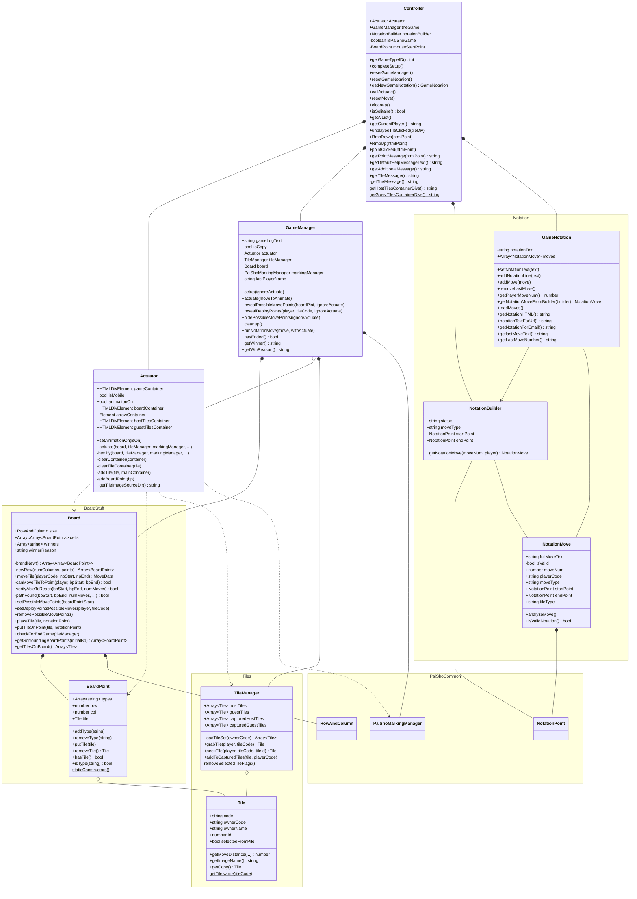
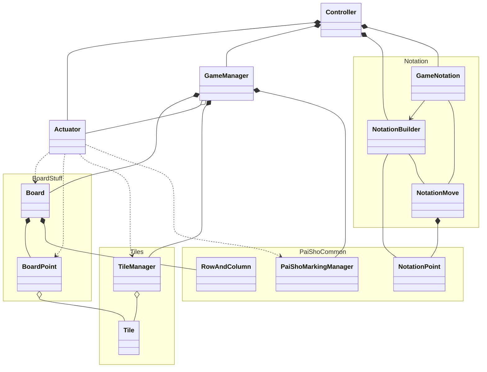
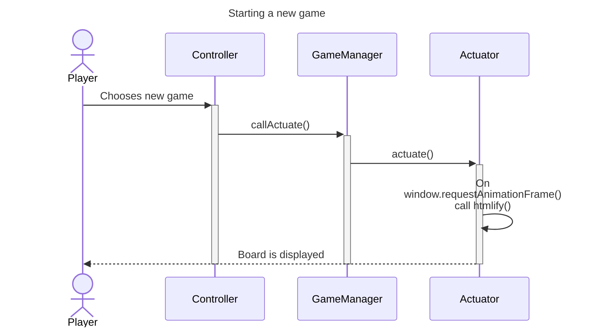
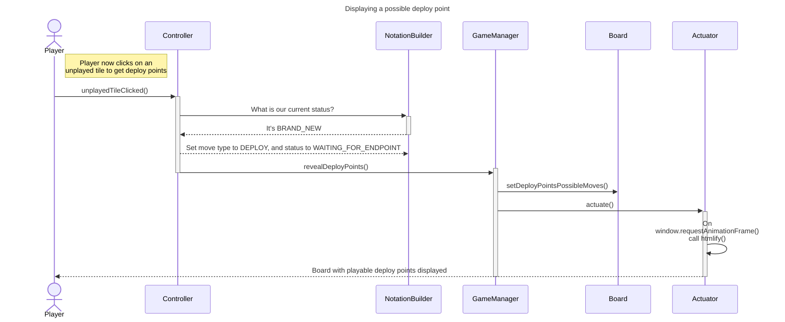
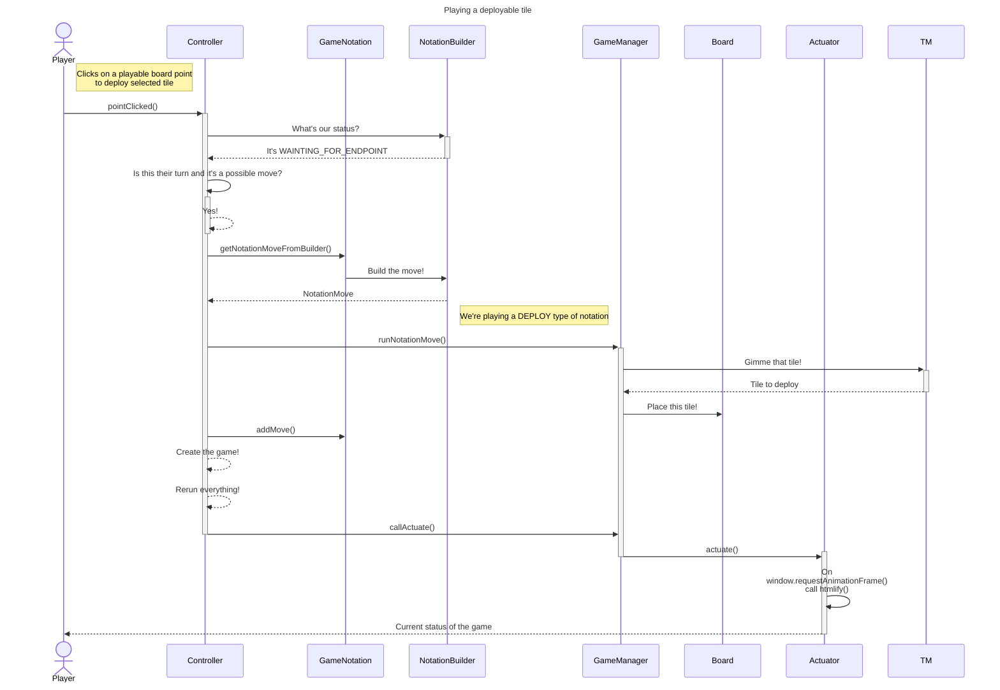
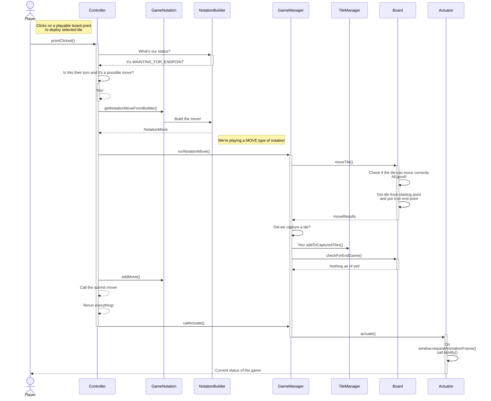

<small>(Oh boy this is going to be a big article that's not going to take me 10 minutes to write)</small>

Greetings! During my summer vacations I participated in building a Pai Sho fangame into something playable. After finishing it I wanted to share my knowledge for any other people who have their own games of their own.

For those who are not in the know of what I'm talking:

## What is Pai Sho?

Pai Sho is the fictional board game that can be found in the _Avatar: The Last Airbender_ series. In reality, there are no real established rules within the lore of the series, so many fans have tried to build their own version of what the game would be played. You can find more information about the game in-lore in [its fandom's wiki.](https://avatar.fandom.com/wiki/Pai_Sho) Generally, players move around tiles with flower decorations to complete _some sort_ of objective (which depends really on what scene the Pai Sho game is being played, some include arranging flowers in to some sort of pattern, or those tiles are located in some sort of arena position).

One of the best iterations of Pai Sho I've ever seen its [Skud Pai Sho](https://skudpaisho.com/site/), made by Skud (hence the name), where the main objective is to arrange your flowers into harmonies (connection between two flowers) that connect around the center of the board (called a harmony ring). Of course I am oversimplfying the rules of the game, and you all should at least try to play it some time.

Other variants which have spawned from Skud's works include:

-   Fire Pai Sho: A quicker version of Skud where tiles are drawn randomly
-   Vagabond Pai Sho: A capture game where tiles are progressively arranged in to an arena in order to capture the opponent's lotus. Inspired by the fan fiction [Gambler and Vagabond](https://skudpaisho.com/site/more/fanfiction-recommendations/)
-   Adevar Pai Sho: Through cunning, discover your opponent's secret objective without letting them know about yours!
-   Gingseng Pai Sho: Advance your lotus tile through the board with the help of your tiles' abilities.
-   Spirit Pai Sho: A simple capture game that is actually a rework of another variant called Capture Pai Sho.

And of course all the other variants that have been developed over the years in the community's discord!

One of these games is called **Wuxing Pai Sho**, made by discord member IndigoGollum (original rule set can be found [here](https://cryptpad.fr/pad/#/2/pad/view/FEjm1WEWn9Sqex9hBOxzBLWcUa0Gb+cLHwAOOY+3-Mg/)) and later continued and refined by Leaves113. Later I took on the challenge of try to code the game in to skudpaisho.com and three months later we're already here!

Due to Indigo's fork policy, I had to rename Leaves' variant to **Godai Pai Sho**, as suggested by another discord member Awyrlas. Godai is the japanese name for the 5-element chinese system called Wuxing.

Here are some relevant links:

> **Godai Pai Sho Ruleset:** [Click here](https://docs.google.com/document/d/1wxZP9MV1EUS8_nWkqGfuPItE225ued1y-fFrFNw6dXU/edit?usp=sharing)

> **Godai Pai Sho Code:** [Click here](https://github.com/KunFuCutsMan/SkudPaiSho/tree/wuxing-pai-sho)

In this article we're only going to cover the explanation of the code, and a general overview of what everything does. Starting with:

## Class Diagram of a Pai Sho Game

Prepare to see an absolute monster of a Class Diagram

{}



{}

Now, I am aware that this is a little _too_ big for someone too see without zooming, so I also have this version without any methods or properties:

{}



{}

## Classes

Do note that generally, all the classes are actually called [Variant Name][Class Name], for example `Controller` in Vagabond is called `VagabondController`. I will refering to the classes are their class name excluding the variant, to make it easier for everybody. Make sure to name your classes with your variant's name prefixed to them.

I have also classified the classes in to what they do; despite what the diagram may indicate, all of the classes (aside the ones labeled inside `PaiShoCommon`) are in the same directory and are not seperated into packages.

The classes labeled under `PaiShoCommon` are provided by the website's code and do what their name. `PaiShoMarkingManager` handles the arrows and marks over the board, and `NotationPoint` and `RowAndColumn` are data objects.

### Top Level Classes

These are classes that the website uses to interact directly with the game (mainly through `Controller`) and its composed components. These classes are `Controller`, `Actuator` and `GameManager`.

#### Controller

The `Controller` class is the entry point of all your code of the game, it handles the creation of your game (starting from when you click on "New Game > Pai Sho Game"), handle events coming from the board's HTML, give message information and other meta-data that may be useful to the website (what kind of game is being played, if it's solaitaire, does it have an AI, etc).

Within the main code, the current `Controller` is saved in a global variable that is accessed in pretty much every function. The methods and properties you see in the first class diagram are the ones that I found are neccesary to play a game.

These are the methods that I find most important for you to understand:

-   **`unplayedTileClicked(tileDiv)`:** This method is called when you click on a tile that is located in a player's library, and sets the game's status to a deploy tile state through `NotationBuilder` and `GameManager`.
-   **`pointClicked(htmlPoint)`:** This method is called when any point on the board is clicked. After parsing the data of the point (as it is a div with its coordinates as its name), it either calls the `GameManager` to show the possible movements of a tile (if there's any on that point), or plays a move on the board based on the movements shown previously, and submits the move made.
-   **`Controller.getHostTilesContainerDivs() & Controller.getGuestTilesContainerDivs()`**: Despite being static methods only returning a string, they actually hold the structure of the tile libraries.

This is what host's tile library looks like, for example:


And the HTML that is used to structure said library:

```js
class Controller {
    // ...

    static getHostTilesContainerDivs() {
        return (
            "" +
            "<span>~Host's Tile Library~</span>" +
            "<br>" +
            '<div class="HWO"></div>' +
            '<div class="HEA"></div>' +
            '<div class="HWA"></div>' +
            '<div class="HFI"></div>' +
            '<div class="HME"></div>' +
            '<br class="clear">' +
            '<div class="HEM"></div>' +
            '<br class="clear">' +
            "<span>~Host's Captured Tiles~</span>" +
            '<span class="tileLibrary"></span>'
        );
    }
}
```

Don't worry about not understanding what exactly this does, we'll get there eventually!

#### Actuator

Throught all the code base, you'll see in other classes that sometimes the code is called to "actuate", you may be wandering, what does this do? Well they call this class' `actuate()` method! The porpuse of the `Actuator` class is to update the board that is displayed to the user according to the state of board or any actions the player has done.


The `actuate()` method actually calls another method, which is called `htmlify()`! This is the method that actually _updates_ everything, starting with marks and arrows made by the user, then empties and refills the tiles in the libraries and then the ones that were captured. Your implementation of this method _may_ vary depending on what your game is like.

Fun fact! The board is remade entirely when this method is called! It's actually a lot easier than to check for any updates for _every single board point._

#### GameManager

As the name suggests, `GameManager` handles everything related to the game. More especifically, it has three main functions:

1. Call the `Board` to reveal playable moves
2. Return the winners of the game based on what `Board` says
3. Run a notation move. This may be one of if not the most important methods for a Pai Sho variant. Not only does the `runNotationMove(move, withActuate)` method interprets the notation move given, it commands the `Board` class to do _exactly what it needs._

As you can see this class handles a lot regarding the board, so why don't we look at those classes then?

### Board Classes

#### Board

This class is both the data object for the grid that is displayed as the game board as represented by `cells`, an array of arrays of `BoardPoint` objects. Aside from that, it also handles stuff like:

1. Moving tiles located in the board itself (and the logic to check if its a valid move)
2. Reveal possible movement and deploy points
3. Check for endgame conditions. The code behind this will depend on your variant's rules. \
   For Godai I had to split this method into two functions which lie outside of the class itself and tons of IF statements

#### BoardPoint

A simple data class that holds information on a especififc point of the board. Not much else. It also has some methods to modify its types, which vary depending on the rules of your variant.

Also, this class will have tons of static constructors which will be used by `Board` to make its board.

### Tiles

#### TileManager

If the `Board` class handles everything regarding what's being played, then `TileManager` takes care of everything that is _not played yet,_ that is, the player's library and captured tiles.

#### Tile

Another data class that doesn't do much other than get moved around the `Board`. If your variant has dynamic movements (like in Godai) then you'll have to do your logic here.

### Notation

All of these classes are tightly coupled, since the `Controller` class uses `NotationBuilder` to make the `NotationMove` that will be passed to `GameManager.runNotationMove()`, and adds it to `GameNotation`.

#### NotationBuilder

As stated previously this is a builder class for `NotationMove`, this is the entirety of it:

```js
export class WuxingNotationBuilder {
    status = BRAND_NEW;

    moveType = "";

    /** @type {NotationPoint} */
    startPoint;

    /** @type {NotationPoint} */
    endPoint;

    /**
     *
     * Taken from CaptureGameNotation.js
     * @param {number} moveNum
     * @param {string} player
     * @returns {WuxingNotationMove}
     */
    getNotationMove(moveNum, player) {
        let notationLine = moveNum + player.charAt(0) + ".";

        if (this.moveType === MOVE) {
            notationLine += `(${this.startPoint.pointText})-(${this.endPoint.pointText})`;
        } else if (this.moveType === DEPLOY) {
            notationLine += `${this.tileType}(${this.endPoint.pointText})`;
        }

        return new WuxingNotationMove(notationLine);
    }
}
```

#### NotationMove

A data class that parses the move it was given as a string. Not much going on here.

#### GameNotation

This class coints an array of all the moves played on the match, and is also used by `Controller` to know what turn the match is in, whose turn is it, and getters for the notation.

Also, its the class that actually calls `NotationBuilder` to actually build a `NotationMove`

## Code flow

Ok so describing each class may not have been a great idea, so instead I'll explain the normal code flow that is portrayed when a player does their move.

{}



{}

{}



{}

{}



{}

{}



{}

Hopefully those diagrams help explain things better, despite the fact I had to leave some stuff out and look at the larger picture. I'll explain things futher as we approach them.

## Conclusions and Thoughts

This article took 4 days to write actually, and I will definitely have to review all of my code and my git tree to see how I made everything 😅

I don't have a set date to upload the next article in this series, but it will be online somewhere along the next month. My university's semester just started this week and I'll have to do a _lot_ of math, starting from today all the way to december.

Next up! Setting up your pai sho enviroment and getting the board to show on screen!
