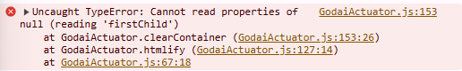

Greetings! As promised in this part of the series we'll make a clickable board for you to play in. This is what we expect to be our end result:



But to reach that we need to modify some files so that the website registers that there is a new pai sho variant in town, so let's start with that first.

## There's a Controller on your lawn

Locate the file named `js/PaiShoMain.js` and open it. You'll encounter around 5.8k lines of codes that are used to run the site in a (semi smootly way). `PaiShoMain.js` contains many functions which are called throught the html, but we won't be touching those. Instead, locate a variable that's somewhere near line 2600 that's called **GameType**, it should be an object with a format like the following:

```js
export var GameType = {
    SkudPaiSho: {
        id: 1,
        name: "Skud Pai Sho",
        desc: "Skud Pai Sho",
        description:
            "Arrange flowers into position while changing the landscape of the board to outpace your opponent.",
        coverImg: "skud.png",
        color: "var(--skudcolor)",
        rulesUrl: "https://skudpaisho.com/site/games/skud-pai-sho/",
        gameOptions: [
            OPTION_INFORMAL_START,
            OPTION_DOUBLE_ACCENT_TILES,
            OPTION_ANCIENT_OASIS_EXPANSION,
            NO_HARMONY_VISUAL_AIDS,
            NO_WHEELS,
            SPECIAL_FLOWERS_BOUNCE,
            NO_ALT_WIN,
        ],
        secretGameOptions: [
            DIAGONAL_MOVEMENT,
            EVERYTHING_CAPTURE,
            IGNORE_CLASHING,
            VARIABLE_ACCENT_TILES, // In development
        ],
    },
    VagabondPaiSho: {
        id: 2,
        name: "Vagabond Pai Sho",
        desc: "Vagabond Pai Sho",
        color: "var(--vagabondcolor)",
        description:
            "Construct a battlefield by deploying tiles across the board, then attack your opponent’s Lotus tile.",
        coverImg: "vagabond.png",
        rulesUrl: "https://skudpaisho.com/site/games/vagabond-pai-sho/",
        gameOptions: [OPTION_DOUBLE_TILES, SWAP_BISON_WITH_LEMUR],
    },
    // ...
};
```

The object is too big for me to copy in this post, but you get the idea. This variable holds the information of the games available on the site, which thanks to some DOM magic are then displayed on the modal that appears when you want to create a new game. You'll need to modify this so you can create a new game.

Add an entry to the object like the following, modifying the values as necesary:

```js
export var GameType = {
    // ...
    },
    GodaiPaiSho: {
		id: 42069, // Funny random number hehe
		name: "Godai Pai Sho", // Name of your game
		desc: "Godai Pai Sho", // Same as above
		color: "var(--othercolor)", // Unless you a especific color in mind and want to modify the CSS, just keep this variable as it is.
		description: "Capture your opponents elemental tiles while protecting your own", // If you're using the Chugi theme, this is what will appear on the card
		coverImg: "lotus.png", // Same as color, unless you want to upload an image, just stay with the lotus icon
		rulesUrl: "https://tinyurl.com/65frxu6h", // Your rules are here
		gameOptions: [ // Refer to the next subsection
			GODAI_BOARD_ZONES,
			GODAI_EMPTY_TILE,
		]
	}
};
```

### What is with `gameOptions`?

Glad you asked! Those constants you see are defined in another file called `js/GameOptions.js`. So go to that file and your optional rules at around line 215 like so:

```js
//...

/* Godai */
export var GODAI_BOARD_ZONES = "GodaiBoardZones";
gameOptionDescriptions[GODAI_BOARD_ZONES] = "Board Zones: Rivers & Mountains";

export var GODAI_EMPTY_TILE = "GodaiEmptyTile";
gameOptionDescriptions[GODAI_EMPTY_TILE] = "Play with Empty tile";

/* -------- */

// ...
```

You'll create a new string variable which will be used to identify your optional rule, then add your description to the map called `gameOptionDescriptions`, with a short description of the rule. Whatever you write in there will appear listed when you create a new game, so be descriptive!

Below you'll also find the way for you to check if a game option is active, `gameOptionEnabled(optionName)`, with the parameter being the key of your game option you want to check. For example, if I want to check that the host decided to play with an empty tile, I'd do the following:

```js
// Import the function and the correspondent optional rule key
import { gameOptionEnabled, GODAI_EMPTY_TILE } from "../GameOptions";

// ...

if (gameOptionEnabled(GODAI_EMPTY_TILE)) {
    // Do stuff
}
```

### You control my life (only on javascript tho)

The only other modification we'll have to do on `PaiShoMain.js` is on the function called `getGameControllerForGameType(gameTypeID)`, near line 2950. Modify the function so the switch statement is like so:

```js
export function getGameControllerForGameType(gameTypeId) {
    var controller;

    var isMobile = mobileAndTabletcheck();

    switch (gameTypeId) {
        case GameType.SkudPaiSho.id:
            controller = new SkudPaiShoController(gameContainerDiv, isMobile);
            break;
        case GameType.VagabondPaiSho.id:
            controller = new VagabondController(gameContainerDiv, isMobile);
            break;

        // ...

        case GameType.GodaiPaiSho.id: // Add your GameType date here
            controller = new GodaiController(gameContainerDiv, isMobile);
            break;
        default:
            debug("Game Controller unavailable.");
    }

    return controller;
}
```

This function is the key for the site gaining access to your game. Remember the [huge class diagram]() from the first entry of this series? This function is called a few lines later on a global variable all around `PaiShoMain.js`. If you want to loose your sanity, search up `gameController` on that file and try to discover all the methods called on the object. Don't do it. Instead create your first file on your pai sho folder like so:

```txt
└─ js
   ├─ ActuatorHelp.js
   ├─ AppCaller.js
   ├─ ...
   ├─ godai <--- Change it according to your variant, all in lowercase
   │  ├─ GodaiController.js   <--- Create your file controller here
   ├─ hexentafl
   ├─ honorary-titles
   ├─ ...
   └─ vagabond
```

And inside make a class skeleton like the following:

```js
import { GodaiActuator } from "./GodaiActuator";
import { GodaiGameManager } from "./GodaiGameManager";
import { GodaiGameNotation } from "./GodaiNotation";
import { GodaiBoardPoint } from "./GodaiBoardPoint";
import { isAnimationsOn } from "../PaiShoMain";
import { GodaiNotationBuilder } from "./GodaiNotation";
import { rerunAll } from "../PaiShoMain";
import { GUEST, HOST, NotationPoint } from "../CommonNotationObjects";

export class GodaiController {
    /** @type {GodaiActuator}          */ actuator;
    /** @type {GodaiGameManager}       */ theGame;
    /** @type {GodaiNotationBuilder}   */ notationBuilder;
    /** @type {GodaiGameNotation}      */ gameNotation;
    /** @type {GodaiBoardPoint | null} */ mouseStartPoint;
    isPaiShoGame = true;

    /**
     * @param {HTMLDivElement} gameContainer This is the div element that your game needs to be put in
     * @param {boolean} isMobile Boolean flag for if running on mobile device
     */
    constructor(gameContainer, isMobile) {
        this.actuator = new GodaiActuator(
            gameContainer,
            isMobile,
            isAnimationsOn()
        );

        this.resetGameManager();
        this.resetNotationBuilder();
        this.resetGameNotation();
    }

    getGameTypeID() {
        return GameType.GodaiPaiSho.id;
    }

    completeSetup() {
        rerunAll();
        this.callActuate();
    }

    resetGameManager() {
        this.theGame = new GodaiGameManager(this.actuator);
    }

    resetNotationBuilder() {
        this.notationBuilder = new GodaiNotationBuilder();
    }

    resetGameNotation() {
        this.gameNotation = this.getNewGameNotation();
    }

    getNewGameNotation() {
        return new GodaiGameNotation();
    }

    callActuate() {
        this.theGame.actuate();
    }
    resetMove() {
        if (this.notationBuilder.status === BRAND_NEW) {
            this.gameNotation.removeLastMove();
        }
        rerunAll();
    }
    cleanup() {}
    isSolitaire() {
        return false;
    }
    getAiList() {
        return [];
    }
    getCurrentPlayer() {
        if (this.gameNotation.moves.length % 2 == 0) return GUEST;
        return HOST;
    }

    /** @param {HTMLDivElement} tileDiv */
    unplayedTileClicked(tileDiv) {}

    /** @param {HTMLDivElement} htmlPoint */
    RmbDown(htmlPoint) {}

    /** @param {HTMLDivElement} htmlPoint */
    RmbUp(htmlPoint) {}

    /** @param {HTMLDivElement} htmlPoint */
    pointClicked(htmlPoint) {}

    /**
     * @param {HTMLDivElement} htmlPoint
     * @returns {{heading: string, message: Array<string>} | null}
     */
    getPointMessage(htmlPoint) {}

    /** @returns {string} */
    getDefaultHelpMessageText() {}

    /** @returns {string} */
    getAdditionalMessage() {}

    /**
     * @param {HTMLDivElement} tileDiv
     * @returns {{heading: string, message: Array<string>}} Message of the tile, given by `getTheMessage(tile, ownerName)`
     */
    getTileMessage(tileDiv) {
        let divName = tileDiv.getAttribute("name");
        let tile = new GodaiTile(divName.substring(1), divName.charAt(0));
        let ownerName = divName.startsWith("G") ? GUEST : HOST;
        return this.getTheMessage(tile, ownerName);
    }

    /**
     * Get the information of a especific tile.
     * @param {GodaiTile} tile
     * @param {string} ownerName
     * @returns {{heading: string, message: Array<string>}} Information to display
     */
    getTheMessage(tile, ownerName) {}

    /** @returns {string} */
    static getHostTilesContainerDivs() {}

    /** @returns {string} */
    static getGuestTilesContainerDivs() {}
}
```

## Spooky Scary Skeleton Files

If you copied the code for the controller class, then you realised that there are some imports you need to handle, and _those_ classes _also_ need their own imports {}(see [MPGC-1]() for reference){}, so let's get those out of the way.

This is around 50% of the code you'll need to run a pai sho variant, be sure to copy these files on the same folder as your controller:

> NOTE: I've added some comments that were not originally in the source code for Godai, you can check them under the label that is in quote space. Search for them as `NOTE: [note here]`



{}

-   [Variant]Actuator.js
-   [Variant]GameManager.js
-   [Variant]Notation.js
-   [Variant]Board.js
-   [Variant]BoardPoint.js
-   [Variant]TileManager.js
-   [Variant]Tile.js

{}

{}

```js
import {
    createBoardArrow,
    createBoardPointDiv,
    setupPaiShoBoard,
} from "../ActuatorHelp.js";
import {
    clearMessage,
    pointClicked,
    RmbDown,
    RmbUp,
    showPointMessage,
} from "../PaiShoMain.js";
import {
    MARKED,
    NON_PLAYABLE,
    POSSIBLE_MOVE,
} from "../skud-pai-sho/SkudPaiShoBoardPoint.js";
import { GodaiController } from "./GodaiController.js";
import { GodaiTileManager } from "./GodaiTileManager.js";

export class GodaiActuator {
    /** @type {HTMLDivElement} */ gameContainer;
    /** @type {boolean}        */ isMobile;
    /** @type {boolean}        */ animationOn;
    /** @type {HTMLDivElement} */ boardContainer;
    /** @type {Element}        */ arrowContainer;
    /** @type {HTMLDivElement} */ hostTilesContainer;
    /** @type {HTMLDivElement} */ guestTilesContainer;

    /**
     * @param {HTMLDivElement} gameContainer
     * @param {boolean} isMovile
     * @param {boolean} enableAnimation
     */
    constructor(gameContainer, isMovile, enableAnimation) {
        this.gameContainer = gameContainer;
        this.isMobile = isMovile;
        this.animationOn = enableAnimation;

        // NOTE: This function is imported from ../ActuatorHelp.js
        let containers = setupPaiShoBoard(
            this.gameContainer,
            GodaiController.getHostTilesContainerDivs(),
            GodaiController.getGuestTilesContainerDivs(),
            false
        );

        this.boardContainer = containers.boardContainer;
        this.arrowContainer = containers.arrowContainer;
        this.hostTilesContainer = containers.hostTilesContainer;
        this.guestTilesContainer = containers.guestTilesContainer;
    }

    setAnimationOn(isOn) {
        this.animationOn = isOn;
    }

    /**
     * Calls forth `this.htmlify()`
     *
     * NOTE: This is function is the key for updating your board state, so you should never call `this.htmlify()` directly
     * @param {GodaiBoard} board
     * @param {GodaiTileManager} tileManager
     * @param {PaiShoMarkingManager} markingManager
     * @param {*} moveToAnimate
     * @param {number} moveAnimationBeginStep
     */
    actuate(
        board,
        tileManager,
        markingManager,
        moveToAnimate,
        moveAnimationBeginStep
    ) {
        let self = this;
        if (!moveAnimationBeginStep) {
            moveAnimationBeginStep = 0;
        }

        window.requestAnimationFrame(function () {
            self.htmlify(board, tileManager, markingManager);
        });
    }

    /**
     * Creates the html grid found on the board
     *
     * @param {GodaiBoard} board
     * @param {GodaiTileManager} tileManager
     * @param {PaiShoMarkingManager} markingManager
     * @param {number} moveToAnimate
     * @param {number} moveAnimationBeginStep
     */
    htmlify(
        board,
        tileManager,
        markingManager,
        moveToAnimate,
        moveAnimationBeginStep
    ) {
        this.clearContainer(this.boardContainer);
        this.clearContainer(this.arrowContainer);

        for (const column of board.cells) {
            for (const cell of column) {
                if (
                    markingManager.pointIsMarked(cell) &&
                    !cell.isType(MARKED)
                ) {
                    cell.addType(MARKED);
                } else if (
                    !markingManager.pointIsMarked(cell) &&
                    cell.isType(MARKED)
                ) {
                    cell.removeType(MARKED);
                }

                if (cell) {
                    this.addBoardPoint(cell);
                }
            }
        }

        // Draw arrows
        for (let [_, arrow] of Object.entries(markingManager.arrows)) {
            this.arrowContainer.appendChild(
                createBoardArrow(arrow[0], arrow[1])
            );
        }

        let fullTileSet = new GodaiTileManager();

        // Go through tile piles and clear containers
        for (const tile of fullTileSet.hostTiles) {
            this.clearTileContainer(tile);
        }
        for (const tile of fullTileSet.guestTiles) {
            this.clearTileContainer(tile);
        }
        // Don't forget the deleted tiles!
        this.clearContainer(
            this.hostTilesContainer.querySelector("span.tileLibrary")
        );
        this.clearContainer(
            this.guestTilesContainer.querySelector("span.tileLibrary")
        );

        // Go through tile piles and display
        for (const tile of tileManager.hostTiles) {
            this.addTile(tile, this.hostTilesContainer);
        }
        for (const tile of tileManager.guestTiles) {
            this.addTile(tile, this.guestTilesContainer);
        }

        // Add deleted tiles
        for (const capturedTile of tileManager.capturedHostTiles) {
            this._addCapturedTile(capturedTile, this.hostTilesContainer);
        }
        for (const capturedTile of tileManager.capturedGuestTiles) {
            this._addCapturedTile(capturedTile, this.guestTilesContainer);
        }
    }

    /** @param {Element} container */
    clearContainer(container) {
        while (container.firstChild) {
            container.removeChild(container.firstChild);
        }
    }

    /**
     * Taken from CaptureActuator.js
     *
     * Remember to add the correct div with its proper tile code in
     * `Controller.getHostTilesContainerDivs()` / `Controller.getGuestTilesContainerDivs()` or else this breaks
     * @param {GodaiTile} tile
     */
    clearTileContainer(tile) {
        let containerClass = "." + tile.getImageName();
        let container = document.querySelector(containerClass);
        while (container.firstChild != null) {
            container.removeChild(container.firstChild);
        }
    }

    /**
     * Taken from CaptureActuator.js
     * @param {GodaiTile} tile
     * @param {HTMLDivElement} mainContainer Seems to be unused, but I'll keep it just in case :)
     */
    addTile(tile, mainContainer) {
        let container = mainContainer.querySelector("." + tile.getImageName());
        let div = document.createElement("div");

        div.classList.add("point");
        div.classList.add("hasTile");

        if (tile.selectedFromPile) {
            div.classList.add("selectedFromPile");
            div.classList.add("drained");
        }

        let img = document.createElement("img");
        let srcValue = this.getTileImageSourceDir();

        img.src = srcValue + tile.getImageName() + ".png";
        div.appendChild(img);

        div.setAttribute("name", tile.getImageName());
        div.setAttribute("id", tile.id);

        if (this.isMobile) {
            div.addEventListener("click", () => {
                unplayedTileClicked(div);
                showTileMessage(div);
            });
        } else {
            div.addEventListener("click", () => unplayedTileClicked(div));
            div.addEventListener("mouseover", () => showTileMessage(div));
            div.addEventListener("mouseout", clearMessage);
        }

        container.appendChild(div);
    }

    /**
     * Function of mine so to seperate concerns
     * @param {GodaiTile} tile
     * @param {HTMLDivElement} mainContainer Container of tiles.
     */
    _addCapturedTile(tile, mainContainer) {
        const capturedContainer =
            mainContainer.querySelector("span.tileLibrary");
        const div = document.createElement("div");

        div.classList.add("point");
        div.classList.add("hasTile");

        const img = document.createElement("img");
        const srcValue = this.getTileImageSourceDir();

        img.src = srcValue + tile.getImageName() + ".png";

        div.appendChild(img);

        div.setAttribute("name", tile.getImageName());
        div.setAttribute("id", tile.id);

        if (this.isMobile) {
            div.addEventListener("click", () => {
                showTileMessage(div);
            });
        } else {
            div.addEventListener("mouseover", () => showTileMessage(div));
            div.addEventListener("mouseout", clearMessage);
        }

        capturedContainer.appendChild(div);
    }

    /**
     * Taken from CaptureActuator.js
     * @param {GodaiBoardPoint} bp
     */
    addBoardPoint(bp) {
        let div = createBoardPointDiv(bp);

        if (!bp.isType(NON_PLAYABLE)) {
            div.classList.add("activePoint");

            if (bp.isType(MARKED)) {
                div.classList.add("markedPoint");
            }

            if (bp.isType(POSSIBLE_MOVE)) {
                div.classList.add("possibleMove");
            }

            if (this.isMobile) {
                div.setAttribute(
                    "ontouchstart",
                    "pointClicked(this); showPointMessage(this);"
                );
            } else {
                div.addEventListener("click", () => pointClicked(div));
                div.addEventListener("mouseover", () => showPointMessage(div));
                div.addEventListener("mouseout", clearMessage);
                div.addEventListener("mousedown", (e) => {
                    // Right Mouse Button
                    if (e.button == 2) {
                        RmbDown(div);
                    }
                });
                div.addEventListener("mouseup", (e) => {
                    // Right Mouse Button
                    if (e.button == 2) {
                        RmbUp(div);
                    }
                });
                div.addEventListener("contextmenu", (e) => {
                    e.preventDefault();
                });
            }
        }

        if (bp.hasTile()) {
            div.classList.add("hasTile");

            let img = document.createElement("img");
            let srcValue = this.getTileImageSourceDir();
            img.src = srcValue + bp.tile.getImageName() + ".png";

            div.appendChild(img);
        }

        this.boardContainer.appendChild(div);
    }

    // NOTE: Check out the other actuators for a better method than staticly adding the link to the images.
    getTileImageSourceDir() {
        return "./images/Godai/" + "original" + "/";
    }
}
```

{}

{}

```js
import { GodaiActuator } from "./GodaiActuator";
import { GodaiTileManager } from "./GodaiTileManager";
import { GodaiBoard } from "./GodaiBoard";
import { PaiShoMarkingManager } from "../pai-sho-common/PaiShoMarkingManager";
import { setGameLogText } from "../PaiShoMain";

export class GodaiGameManager {
    /** @type {string}               */ gameLogText;
    /** @type {boolean}              */ isCopy;
    /** @type {GodaiActuator}        */ actuator;
    /** @type {GodaiTileManager}     */ tileManager;
    /** @type {GodaiBoard}           */ board;
    /** @type {GodaiTileManager}     */ tileManager;
    /** @type {PaiShoMarkingManager} */ markingManager;
    /** @type {string}               */ lastPlayerName;

    constructor(actuator, ignoreActuate, isCopy) {
        this.gameLogText = "";
        this.isCopy = isCopy;
        this.actuator = actuator;

        this.tileManager = new GodaiTileManager();
        this.markingManager = new PaiShoMarkingManager();

        this.setup(ignoreActuate);
    }

    /** Set up the game */
    setup(ignoreActuate) {
        this.board = new GodaiBoard();

        if (!ignoreActuate) {
            this.actuate();
        }
    }

    /** @param {*} moveToAnimate */
    actuate(moveToAnimate) {
        if (this.isCopy) return;

        this.actuator.actuate(
            this.board,
            this.tileManager,
            this.markingManager,
            moveToAnimate
        );
        setGameLogText(this.gameLogText); // NOTE: This is imported from ../PaiShoMain.js
    }

    /**
     * @param {GodaiBoardPoint} boardPoint
     * @param {boolean} ignoreActuate
     */
    revealPossibleMovePoints(boardPoint, ignoreActuate) {
        if (!boardPoint.hasTile()) return;

        this.board.setPossibleMovePoints(boardPoint);

        if (!ignoreActuate) {
            this.actuate();
        }
    }

    revealDeployPoints(player, tileCode, ignoreActuate) {
        this.board.setDeployPointsPossibleMoves(player, tileCode);

        if (!ignoreActuate) {
            this.actuate();
        }
    }

    hidePossibleMovePoints(ignoreActuate) {
        this.board.removePossibleMovePoints();
        this.tileManager.removeSelectedTileFlags();
        if (!ignoreActuate) {
            this.actuate();
        }
    }

    cleanup() {}

    /**
     * NOTE: This method will be covered in another time
     * @param {GodaiNotationMove} move Move to play
     * */
    runNotationMove(move, withActuate) {}

    hasEnded() {
        return this.board.winners.length > 0;
    }

    getWinner() {
        if (this.board.winners.length === 1) {
            return this.board.winners[0];
        } else if (this.board.winners.length > 1) {
            return "BOTH players";
        }
    }

    getWinReason() {
        return this.board.winnerReason;
    }
}
```

{}

{}

```js
// NOTE: There are three classes here, they're all related so here's where they are all located
import { BRAND_NEW } from "../PaiShoMain.js";

export class GodaiNotationMove {
    fullMoveText = "";
    isValid = false;

    /** @type {number} */
    moveNum = 0;
    playerCode = "";
    moveType = "";

    // MOVE information
    /** @type {NotationPoint} */ startPoint;
    /** @type {NotationPoint} */ endPoint;

    // DEPLOY information
    tileType = "";

    constructor(text) {
        this.fullMoveText = text;
        this.analyzeMove();
    }

    /**
     * Based on `this.fullMoveText`, decides if its a valid move notation or not
     *
     * NOTE: This method will be covered in a later post
     */
    analyzeMove() {}

    isValidNotation() {
        return this.isValid;
    }
}

export class GodaiGameNotation {
    /** @type {string} */
    notationText = "";

    /** @type {Array<GodaiNotationMove>} */
    moves = [];

    /** @param {string} text */
    setNotationText(text) {
        this.notationText = text;
        this.loadMoves();
    }

    /** @param {string} text */
    addNotationLine(text) {
        this.notationText += ";" + text.trim();
        this.loadMoves();
    }

    /** @param {GodaiNotationMove} move  */
    addMove(move) {
        if (this.notationText) {
            this.notationText += ";" + move.fullMoveText;
        } else {
            this.notationText = move.fullMoveText;
        }

        this.loadMoves();
    }

    removeLastMove() {
        this.notationText = this.notationText.substring(
            0,
            this.notationText.lastIndexOf(";")
        );
        this.loadMoves();
    }

    getPlayerMoveNum() {
        let moveNum = 1;
        let lastMove = this.moves[this.moves.length - 1];

        if (lastMove) {
            moveNum = lastMove.moveNum;
            if (lastMove.playerCode == GUEST) {
                moveNum++;
            }
        }

        return moveNum;
    }

    /**
     * NOTE: If your game starts with HOST may want to modify this method accordingly,
     * look at the other GameNotations from variants that start with host
     * @param {GodaiNotationBuilder} builder
     * @returns {GodaiNotationMove}
     */
    getNotationMoveFromBuilder(builder) {
        let moveNum = 1;
        let player = GUEST;
        let lastMove = this.moves[this.moves.length - 1];

        if (lastMove) {
            moveNum = lastMove.moveNum;

            if (lastMove.moveNum === 0 && lastMove.playerCode === HOST) {
                player = GUEST;
            } else if (
                lastMove.moveNum === 0 &&
                lastMove.playerCode === GUEST
            ) {
                moveNum++;
                player = GUEST;
            } else if (lastMove.playerCode === HOST) {
                moveNum++;
            } else {
                player = HOST;
            }
        }

        return builder.getNotationMove(moveNum, player);
    }

    /**
     * For each move split from `this.notationText`, analyze each one of them and add them to `this.moves`
     * if they're valid
     */
    loadMoves() {
        this.moves = [];
        let lines = [];
        if (this.notationText) {
            if (this.notationText.includes(";")) {
                lines = this.notationText.split(";");
            } else {
                lines = [this.notationText];
            }
        }

        let lastPlayer = HOST; // Lets say the host started the game
        for (const line of lines) {
            let move = new GodaiNotationMove(line);
            if (move.isValidNotation() && move.playerCode !== lastPlayer) {
                this.moves.push(move);
                lastPlayer = move.player;
            } else {
                debug("the player check is broken?");
            }
        }
    }

    /* GETTERS FOR TEXT */

    getNotationHtml() {
        let lines = [];
        if (this.notationText) {
            if (this.notationText.includes(";")) {
                lines = this.notationText.split(";");
            } else {
                lines = [this.notationText];
            }
        }

        let notationHTML = lines.reduce(
            (acc, line) => (acc += line + "<br />"),
            ""
        );
        return notationHTML;
    }

    notationTextForUrl() {
        return this.notationText;
    }

    getNotationForEmail() {
        let lines = [];
        if (this.notationText) {
            if (this.notationText.includes(";")) {
                lines = this.notationText.split(";");
            } else {
                lines = [this.notationText];
            }
        }

        let notationHTML = lines.reduce(
            (acc, line) => (acc += line + "[BR]"),
            ""
        );
        return notationHTML;
    }

    getLastMoveText() {
        return this.moves[this.moves.length - 1].fullMoveText;
    }

    getLastMoveNumber() {
        return this.moves[this.moves.length - 1].moveNum;
    }
}

export class GodaiNotationBuilder {
    status = BRAND_NEW;

    moveType = "";
    plantedlowerType = "";

    // NOTE: These are imported from ..CommonNotationObjects along with the HOST and GUEST keywords
    /** @type {NotationPoint} */ startPoint;
    /** @type {NotationPoint} */ endPoint;

    /**
     *
     * Taken from CaptureGameNotation.js
     * @param {number} moveNum
     * @param {string} player
     * @returns {GodaiNotationMove}
     */
    getNotationMove(moveNum, player) {
        let notationLine = moveNum + player.charAt(0) + ".";

        if (this.moveType === MOVE) {
            notationLine += `(${this.startPoint.pointText})-(${this.endPoint.pointText})`;
        } else if (this.moveType === DEPLOY) {
            notationLine += `${this.tileType}(${this.endPoint.pointText})`;
        }

        return new GodaiNotationMove(notationLine);
    }
}
```

{}

{}

Mind you, this class will get even bigger by the end of this, _you've been warned._

```js
import { RowAndColumn } from "../CommonNotationObjects";
import { GodaiBoardPoint } from "./GodaiBoardPoint";
import { NON_PLAYABLE } from "../skud-pai-sho/SkudPaiShoBoardPoint";

export class GodaiBoard {
    /** @type {RowAndColumn} */ size;
    /** @type {Array<Array<GodaiBoardPoint>>} */ cells;
    /** @type {Array<string>} */ winners;
    /** @type {string} */ winnerReason = "";

    constructor() {
        // NOTE: If your variant is played on intersections, then keep the size as it is.
        // If it is instead played in spaces like in Adevar, then change it to 18x18
        this.size = new RowAndColumn(17, 17);
        this.cells = this.brandNew();
        this.winners = [];
    }

    // NOTE: The whole reason this class is so bloated and is around 600 lines long
    brandNew() {}

    /**
     * Taken from SpiritBoard.js
     * @param {number} numColumns Number of Columns to add. They're added from the center
     * @param {Array<GodaiBoardPoint>} points points to add, from left to right
     * @returns {Array<GodaiBoardPoint>}
     */
    newRow(numColumns, points) {
        let cells = [];
        let numBlanksOnSides = (this.size.row - numColumns) / 2;

        let nonPoint = new GodaiBoardPoint();
        nonPoint.addType(NON_PLAYABLE);

        for (var i = 0; i < this.size.row; i++) {
            if (i < numBlanksOnSides) {
                cells[i] = nonPoint;
            } else if (i < numBlanksOnSides + numColumns) {
                if (points) {
                    cells[i] = points[i - numBlanksOnSides];
                } else {
                    cells[i] = nonPoint;
                }
            } else {
                cells[i] = nonPoint;
            }
        }

        return cells;
    }

    /**
     * Taken from VagabondBoard.js
     * @param {GodaiBoardPoint} bpStart
     * @param {GodaiBoardPoint} bpEnd
     * @param {number} numMoves
     */
    _verifyAbleToReach(bpStart, bpEnd, numMoves) {
        // Recursion!
        return this._pathFound(bpStart, bpEnd, numMoves, bpStart);
    }

    /**
     * Taken from VagabondBoard.js
     *
     * NOTE: This method, along with others that were made exclusively for this one,
     * are the *second* reason why this class is so bloated
     * @param {GodaiBoardPoint} bpStart
     * @param {GodaiBoardPoint} bpEnd
     * @param {number} numMoves
     */
    _pathFound(bpStart, bpEnd, numMoves) {}

    /**
     * @param {string} playerCode GUEST or HOST
     * @param {NotationPoint} notationPointStart
     * @param {NotationPoint} notationPointEnd
     */
    moveTile(playerCode, notationPointStart, notationPointEnd) {}

    /**
     * Taken from VagabondBoard.js
     * @param {GodaiBoardPoint} boardPointStart
     */
    setPossibleMovePoints(boardPointStart) {}

    /**
     * @param {string} player HOST or GUEST
     * @param {string} tileCode
     * @returns
     */
    setDeployPointsPossibleMoves(player, tileCode) {}

    removePossibleMovePoints() {
        this.cells.forEach((row) => {
            row.forEach((bp) => bp.removeType(POSSIBLE_MOVE));
        });
    }

    /**
     *
     * @param {GodaiTile} tile
     * @param {NotationPoint} notationPoint
     */
    placeTile(tile, notationPoint) {
        this.putTileOnPoint(tile, notationPoint);

        // Things to do after a tile is placed

        // Nothing :)
    }

    putTileOnPoint(tile, notationPoint) {
        let p = notationPoint.rowAndColumn;
        let point = this.cells[p.row][p.col];
        point.putTile(tile);
    }

    /**
     * Checks whether a player has won, and adds it as a winner and the reason why.
     * @param {GodaiTileManager} tileManager Contains all the tiles neccesary to check if a player has won
     */
    checkForEndGame(tileManager) {}

    /**
     * NOTE: This methods will be useful when calculating possible moves,
     * be sure to look at the boards to see any other methods used for unortodox movements!
     * @param {RowAndColumn} rowAndCol
     * @returns {Array<RowAndColumn>}
     */
    getSurroundingBoardPoints(initialBoardPoint) {
        var surroundingPoints = [];
        for (
            var row = initialBoardPoint.row - 1;
            row <= initialBoardPoint.row + 1;
            row++
        ) {
            for (
                var col = initialBoardPoint.col - 1;
                col <= initialBoardPoint.col + 1;
                col++
            ) {
                if (
                    (row !== initialBoardPoint.row ||
                        col !== initialBoardPoint.col) && // Not the center given point
                    row >= 0 &&
                    col >= 0 &&
                    row < 17 &&
                    col < 17
                ) {
                    // Not outside range of the grid
                    var boardPoint = this.cells[row][col];
                    if (!boardPoint.isType(NON_PLAYABLE)) {
                        // Not non-playable
                        surroundingPoints.push(boardPoint);
                    }
                }
            }
        }
        return surroundingPoints;
    }

    getTilesOnBoard() {
        let tiles = [];

        for (const row of this.cells) {
            for (const bp of row) {
                if (!bp.isType(NON_PLAYABLE) && bp.hasTile()) {
                    tiles.push(bp.tile);
                }
            }
        }

        return tiles;
    }
}
```

{}

{}

```js
// NOTE: You will export your board point types from here

export class GodaiBoardPoint {
    /** @type {Array<string>} */ types;
    /** @type {number}        */ row;
    /** @type {number}        */ col;
    /** @type {GodaiTile}     */ tile;

    constructor() {
        this.types = [];
        this.row = -1;
        this.col = -1;
    }

    /**
     * Taken from SpiritBoardPoint.js
     * @param {string} type Type of point. Use constants only.
     */
    addType(type) {
        if (!this.types.includes(type)) {
            this.types.push(type);
        }
    }

    /**
     * Taken from SpiritBoardPoint.js
     * @param {string} type Type of point. Use constants only.
     */
    removeType(type) {
        for (let i = 0; i < this.types.length; i++) {
            if (this.types[i] === type) {
                this.types.splice(i, 1);
            }
        }
    }

    /**
     * Taken from SpiritBoardPoint.js
     * @param {GodaiTile} tile
     */
    putTile(tile) {
        this.tile = tile;
    }

    removeTile() {
        let tile = this.tile;
        this.tile = null;
        return tile;
    }

    /**
     * Taken from SpiritBoardPoint.js
     */
    hasTile() {
        if (this.tile) return true;
        return false;
    }

    isType(type) {
        return this.types.includes(type);
    }

    /* POINT TYPES */

    // NOTE: Here you will place all your board point types as static constructors. I'll leave you with two examples:

    static neutral() {
        let point = new GodaiBoardPoint();
        point.addType(NEUTRAL);
        return point;
    }

    static gate() {
        let point = new GodaiBoardPoint();
        point.addType(GATE);
        return point;
    }
}
```

{}

{}

```js
import { GUEST, HOST } from "../CommonNotationObjects";
import { debug } from "../GameData";
import { GodaiTile } from "./GodaiTile";

export class GodaiTileManager {
    /** @type {Array<GodaiTile>} */ hostTiles;
    /** @type {Array<GodaiTile>} */ guestTiles;
    /** @type {Array<GodaiTile>} */ capturedHostTiles;
    /** @type {Array<GodaiTile>} */ capturedGuestTiles;

    constructor() {
        this.hostTiles = this.loadTileSet("H");
        this.guestTiles = this.loadTileSet("G");

        this.capturedHostTiles = [];
        this.capturedGuestTiles = [];
    }

    /**
     * NOTE: We'll check this out later
     * @param {'G' | 'H'} tileCode
     * @returns {Array<GodaiTile>} array of tiles
     */
    loadTileSet(ownerCode) {
        let tiles = [];
        return tiles;
    }

    /**
     * Grabs a tile from the corresponding tile and returns it.
     * @param {string} player HOST or GUEST
     * @param {string} tileCode tilecode
     * @returns {GodaiTile | null}
     */
    grabTile(player, tileCode) {
        let tilePile = player == HOST ? this.hostTiles : this.guestTiles;

        /** @type {GodaiTile} */
        let tile;
        for (var i = 0; i < tilePile.length; i++) {
            if (tilePile[i].code === tileCode) {
                var newTileArr = tilePile.splice(i, 1);
                tile = newTileArr[0];
                break;
            }
        }

        if (!tile) {
            debug(
                "And we didn't get any tiles from params: " +
                    player +
                    " " +
                    tileCode
            );
        }

        return tile;
    }

    peekTile(player, tileCode, tileId) {
        let tilePile = player === HOST ? this.hostTiles : this.guestTiles;

        if (tileId) {
            for (let i = 0; i < tilePile.length; i++) {
                if (tilePile[i].id === tileId) {
                    return tilePile[i];
                }
            }
        }

        for (let i = 0; i < tilePile.length; i++) {
            if (tilePile[i].code === tileCode) {
                return tilePile[i];
            }
        }
    }

    /**
     *
     * @param {GodaiTile} tile
     * @param {string} playerCode GUEST or HOST
     */
    addToCapturedTiles(tile, playerCode) {
        if (playerCode === GUEST) {
            this.capturedGuestTiles.push(tile);
        } else if (playerCode === HOST) {
            this.capturedHostTiles.push(tile);
        }
    }

    removeSelectedTileFlags() {
        this.hostTiles.forEach((tile) => (tile.selectedFromPile = false));
        this.guestTiles.forEach((tile) => (tile.selectedFromPile = false));
    }
}
```

{}

{}

```js
import { GUEST, HOST } from "../CommonNotationObjects";
import { debug } from "../GameData";
import { tileIdIncrement } from "../skud-pai-sho/SkudPaiShoTile";

// NOTE: Here you'll define your tile type constants for easy use and identification
// This will be done on a later post

export class GodaiTile {
    /** @type {string}  */ code;
    /** @type {string}  */ ownerCode;
    /** @type {string}  */ ownerName;
    /** @type {number}  */ id;
    /** @type {boolean} */ selectedFromPile;

    /**
     * @param {string} code Identifies the tile
     * @param {'G'|'H'} ownerCode Identifies the player who owns the tile.
     */
    constructor(code, ownerCode) {
        this.code = code;
        this.ownerCode = ownerCode;

        if (this.ownerCode === "G") {
            this.ownerName = GUEST;
        } else if (this.ownerCode === "H") {
            this.ownerName = HOST;
        } else {
            debug("INCORRECT OWNER CODE");
        }

        this.id = tileIdIncrement();
    }

    /**
     * Calculates the moving distance of a tile based on the sorrounding board points.
     *
     * NOTE: This method may vary on your use, for now lets just return an arbitrary number so the code is happy.
     *
     * NOTE: If your game has complex interactions based on the tile's sorroundings, this method will grow. A lot.
     * @returns {number} Moving distance based on its sorrounding conditions
     */
    getMoveDistance(sorroundingBPs, isInGate) {
        return 3;
    }

    getImageName() {
        return this.ownerCode + "" + this.code;
    }

    getCopy() {
        return new GodaiTile(this.code, this.ownerCode);
    }

    static getTileName(tileCode) {
        let name = "";

        // NOTE: At a later post this method will use the tile type constants I've mentioned earlier.
        // For now, your tiles without an identity

        return name;
    }
}
```

{}



Now that files are out of the way, we can continue

## There's a board on your lawn

Now if you copied everything correctly you should get the following result:



And if somehow cannot see the video, then this is what's happening:

1. When we click on the "New" Button we get the selection of the games available as defined by the `GameType` object, and when we click on the game of our choice, the current controller is replaced by a new one, and is referenced throught the website.
2. When the code reaches for the parts of the side board and help tab, it returns undefined since we haven't really defined those stuff yet. We'll fix that later.
3. The board image and the HTML used for clicking the intersections are different! If you inspect the board then you'll notice its a background image made with CSS, and that the div with class `.pointContainer` is empty.

Of course we cannot work on our game if _there is no board to play it on_, so lets (finally) add a board to our variant.

> NOTE: Since this guide is using a game that plays on intersections as an example, I won't provide the steps if you want to play on intersections _yet_. You can check out how its done in the Adevar and Key board classes if you want, the process should be similar to the one I'll describe.

Go ahead and look into any `Board` Class that's already implemented (say, the `SkudPaiShoBoard` one) and look at the `brandNew()` method:

```js
SkudPaiShoBoard.prototype.brandNew = function () {
    var cells = [];

    cells[0] = this.newRow(9, [
        SkudPaiShoBoardPoint.neutral(),
        SkudPaiShoBoardPoint.neutral(),
        SkudPaiShoBoardPoint.neutral(),
        SkudPaiShoBoardPoint.neutral(),
        SkudPaiShoBoardPoint.gate(),
        SkudPaiShoBoardPoint.neutral(),
        SkudPaiShoBoardPoint.neutral(),
        SkudPaiShoBoardPoint.neutral(),
        SkudPaiShoBoardPoint.neutral(),
    ]);

    cells[1] = this.newRow(11, [
        SkudPaiShoBoardPoint.neutral(),
        SkudPaiShoBoardPoint.neutral(),
        SkudPaiShoBoardPoint.neutral(),
        SkudPaiShoBoardPoint.neutral(),
        SkudPaiShoBoardPoint.neutral(),
        SkudPaiShoBoardPoint.redWhiteNeutral(),
        SkudPaiShoBoardPoint.neutral(),
        SkudPaiShoBoardPoint.neutral(),
        SkudPaiShoBoardPoint.neutral(),
        SkudPaiShoBoardPoint.neutral(),
        SkudPaiShoBoardPoint.neutral(),
    ]);

    cells[2] = this.newRow(13, [
        SkudPaiShoBoardPoint.neutral(),
        SkudPaiShoBoardPoint.neutral(),
        SkudPaiShoBoardPoint.neutral(),
        SkudPaiShoBoardPoint.neutral(),
        SkudPaiShoBoardPoint.neutral(),
        SkudPaiShoBoardPoint.whiteNeutral(),
        SkudPaiShoBoardPoint.redWhite(),
        SkudPaiShoBoardPoint.redNeutral(),
        SkudPaiShoBoardPoint.neutral(),
        SkudPaiShoBoardPoint.neutral(),
        SkudPaiShoBoardPoint.neutral(),
        SkudPaiShoBoardPoint.neutral(),
        SkudPaiShoBoardPoint.neutral(),
    ]);

    cells[3] = this.newRow(15, [
        SkudPaiShoBoardPoint.neutral(),
        SkudPaiShoBoardPoint.neutral(),
        SkudPaiShoBoardPoint.neutral(),
        SkudPaiShoBoardPoint.neutral(),
        SkudPaiShoBoardPoint.neutral(),
        SkudPaiShoBoardPoint.whiteNeutral(),
        SkudPaiShoBoardPoint.white(),
        SkudPaiShoBoardPoint.redWhite(),
        SkudPaiShoBoardPoint.red(),
        SkudPaiShoBoardPoint.redNeutral(),
        SkudPaiShoBoardPoint.neutral(),
        SkudPaiShoBoardPoint.neutral(),
        SkudPaiShoBoardPoint.neutral(),
        SkudPaiShoBoardPoint.neutral(),
        SkudPaiShoBoardPoint.neutral(),
    ]);

    cells[4] = this.newRow(17, [
        SkudPaiShoBoardPoint.neutral(),
        SkudPaiShoBoardPoint.neutral(),
        SkudPaiShoBoardPoint.neutral(),
        SkudPaiShoBoardPoint.neutral(),
        SkudPaiShoBoardPoint.neutral(),
        SkudPaiShoBoardPoint.whiteNeutral(),
        SkudPaiShoBoardPoint.white(),
        SkudPaiShoBoardPoint.white(),
        SkudPaiShoBoardPoint.redWhite(),
        SkudPaiShoBoardPoint.red(),
        SkudPaiShoBoardPoint.red(),
        SkudPaiShoBoardPoint.redNeutral(),
        SkudPaiShoBoardPoint.neutral(),
        SkudPaiShoBoardPoint.neutral(),
        SkudPaiShoBoardPoint.neutral(),
        SkudPaiShoBoardPoint.neutral(),
        SkudPaiShoBoardPoint.neutral(),
    ]);

    // ...
    // This goes on and on until we reach index 16 of the cells variable

    for (var row = 0; row < cells.length; row++) {
        for (var col = 0; col < cells[row].length; col++) {
            cells[row][col].row = row;
            cells[row][col].col = col;
        }
    }

    return cells;
};
```

The function that does all the heavy lifting is `newRow()`, which if you copied the skeleton files earlier then you already have it implemented :D

That method will fill make an array of points, align them to the center and fill them with whatever is provided in the second argument. Any other spaces are then filled with NON_PLAYABLE board points. You can guess what those do :) \
If you look at the method then you'll notice the size of the row that is used depends on the `RowAndColumn` object that defines the board size, so you don't have to worry about the board size.

If the board isn't rotated, then the board points you see on screen will have the same arrangement as what is declared on the code. Here's an ilustrated example using a small 9 x 9 board:

```txt
Index                this.newRow( numColumns, points )
 [0]  ( )( )( )[N][G][N]( )( )( )     3     , [ N, G, N ]
 [1]  ( )( )[N][N][m][N][N]( )( )     5     , [N, N, m, N, N]
 [2]  ( )[N][N][w][m][r][N][N]( )     7     , [N, N, w, m, r, N, N]
 [3]  [N][N][w][w][m][r][r][N][N]     9     , [N, N, w, w, m, r, r, N, N]
 [4]  [G][m][m][m][m][m][m][m][G]     9     , [G, m, m, m, m, m, m, m, G]
 [5]  [N][N][r][r][m][w][w][N][N]     9     , [N, N, r, r, m, w, w, N, N]
 [6]  ( )[N][N][r][m][w][N][N]( )     7     , [N, N, r, m, w, N, N]
 [7]  ( )( )[N][N][m][N][N]( )( )     5     , [N, N, m, N, N]
 [8]  ( )( )( )[N][G][N]( )( )( )     3     , [N, G, N]
```

For each row, starting from the top, you assign the row using the `newRow()` method as shown, you first insert the number of points you're going to insert, then in the next argument the board points in question in the order they appear in from left to right. It's quite simple, isn't?

Surprisingly, it is, but we won't be personally making a new board point especifically for our board points because that would be tedious, instead we'll make some constructors for our different types of board points.

Remember the note I left on `[Variant]BoardPoint.js`? The one located above some static methods? Those are our board point constructors! Here's again the ones ones I used in Godai:

```js
export class GodaiBoardPoint {
    // ...

    // ...

    static neutral() {
        let point = new GodaiBoardPoint();
        point.addType(NEUTRAL);
        return point;
    }

    static gate() {
        let point = new GodaiBoardPoint();
        point.addType(GATE);
        return point;
    }

    // Extending a gate board point so its a certain type,
    // since tiles can only be deployed in their colored gate
    static blackGate() {
        let p = GodaiBoardPoint.gate();
        p.addType(BLACK_GATE);
        return p;
    }

    static greenGate() {
        let p = GodaiBoardPoint.gate();
        p.addType(GREEN_GATE);
        return p;
    }

    static redGate() {
        let p = GodaiBoardPoint.gate();
        p.addType(RED_GATE);
        return p;
    }

    static whiteGate() {
        let p = GodaiBoardPoint.gate();
        p.addType(WHITE_GATE);
        return p;
    }

    static yellowGate() {
        let p = GodaiBoardPoint.gate();
        p.addType(YELLOW_GATE);
        return p;
    }

    // Rivers are the garden borders
    static river() {
        let p = new GodaiBoardPoint();
        p.addType(RIVER_TILE);
        return p;
    }

    static riverDownLeft() {
        let p = GodaiBoardPoint.river();
        p.addType(RIVER_DL_TILE);
        return p;
    }

    static riverDownRight() {
        let p = GodaiBoardPoint.river();
        p.addType(RIVER_DR_TILE);
        return p;
    }

    static mountain() {
        let p = new GodaiBoardPoint();
        p.addType(MOUNTAIN_TILE);
        return p;
    }

    static mountainEntrance() {
        let p = new GodaiBoardPoint();
        p.addType(MOUNTAIN_ENTRANCE);
        return p;
    }

    static mountainEntranceWithRiver() {
        let p = GodaiBoardPoint.mountainEntrance();
        p.addType(RIVER_TILE);
        return p;
    }

    static mountainEntranceWithRiverDL() {
        let p = GodaiBoardPoint.mountainEntranceWithRiver();
        p.addType(RIVER_DL_TILE);
        return p;
    }

    static mountainEntranceWithRiverDR() {
        let p = GodaiBoardPoint.mountainEntranceWithRiver();
        p.addType(RIVER_DR_TILE);
        return p;
    }

    /**
     * Adds the `WESTERN_RIVER` type to `p`
     * @param {GodaiBoardPoint} p
     * @returns {GodaiBoardPoint}
     */
    static western(p) {
        p.addType(WESTERN_RIVER);
        return p;
    }

    /**
     * Adds the `EASTERN_RIVER` type to `p`
     * @param {GodaiBoardPoint} p
     * @returns {GodaiBoardPoint}
     */
    static eastern(p) {
        p.addType(EASTERN_RIVER);
        return p;
    }
}
```

Now that I look back on my code, I could have saved some lines by a constructor method that simply returns the board point with the new types added, something like this:

```js
class GodaiBoardPoint {

    static with( boardPoint, ...attributes ) {
        for ( const attribute of attributes ) {
            boardPoint.addType(attribute)
        }¿
        return boardPoint
    }
}

// The implementation of the board point that is located next to the eastern gate,
// since it is both a mountain entrance AND part of the eastern river
let boardPoint = GodaiBoardPoint.with( GodaiBoardPoint.mountainEntrance(), RIVER_TILE, RIVER_DL_TILE, EASTERN )
```

The types of board points you will use will vary with your variant's rules. If you're playing with a standard board then you can copy the code located on `SkudPaiShoBoard.js` or `VagabondBoard.js`. In the case for godai, I've had to modify this method several times as I implemented features (most prominently, when adding the logic for board zones and rivers).

I highly recommend that if your game has an option regarding special effects that occur when a tile is located on _some_ part of the board, you define said type of board point as a default, then handle the logic when interacting with your tiles.

### Great, but where do I define the board point types?

Excelent question! If you've noticed then we're using some constants to define the different board point types. Set those up just above your `[Variant]BoardPoint` class, like so:

```js
import { GATE, NEUTRAL } from "../skud-pai-sho/SkudPaiShoBoardPoint";

export let BLACK_GATE = "Black Gate";
export let GREEN_GATE = "Green Gate";
export let RED_GATE = "Red Gate";
export let WHITE_GATE = "White Gate";
export let YELLOW_GATE = "Yellow Gate";
export let RIVER_TILE = "River Tile";
export let RIVER_DL_TILE = "River (Down-Left) Tile";
export let RIVER_DR_TILE = "River (Down-Right) Tile";
export let MOUNTAIN_TILE = "Mountain Tile";
export let MOUNTAIN_ENTRANCE = "Mountain Entrance";
export let WESTERN_RIVER = "Western River";
export let EASTERN_RIVER = "Eastern River";
export let IS_DAMMED_RIVER = "RIVER IS DAMMED";

export class GodaiBoardPoint {
    // ...
}
```

There's no need to get crazy on what your constants have to be, but I reccomend you follow what is done on the rest of the code base and save them as strings with the name of whatever the constant represents. A touch I added personally is typing those constants in snake case so they stand out from normal variables.

At last, if you coded everything correctly, when you click play new game and your controller is loaded, then...



The div elements now appear and contain their coordenates. Also, if you hover over them you can see that while the intersection is displayed, nothing changes on the sidebar. That's because we haven't defined any behaviour in the `Controller.RmbDown()`, `Controller.RmbUp()`, `Controller.PointClicked()` and `Controller.getPointMessage()` methods. Those will be taken care of in a future time, but if you've opened up your devtools you may have noticed the following error:



Let's fix that uncaught error first. Go to line 127 of your actuator class and you'll see the following snippet of code:

```js
// Don't forget the deleted tiles!
this.clearContainer(
    this.hostTilesContainer.querySelector("span.tileLibrary") // <-- Where the error happens
);
this.clearContainer(this.guestTilesContainer.querySelector("span.tileLibrary"));
```

We're trying to look for a span which is the tile library, but that doesn't exist since the methods we've provided for making _said html_ only returns an empty string.

Go to your `Controller` class and modify the `get[Player]TilesContainerDivs` static methods to return some HTML like the following:

```js
/** @returns {string} */
static getHostTilesContainerDivs() {
    return '' +
        '<span>~Host\'s Tile Library~</span>' +
        '<br>' +
        '<div class="HWO"></div>' +
        '<div class="HEA"></div>' +
        '<div class="HWA"></div>' +
        '<div class="HFI"></div>' +
        '<div class="HME"></div>' +
        '<br class="clear">' +
        '<div class="HEM"></div>' +
        '<br class="clear">' +
        '<span>~Host\'s Captured Tiles~</span>' +
        '<span class="tileLibrary"></span>'
}

/** @returns {string} */
static getGuestTilesContainerDivs() {
    return '' +
        '<span>~Guest\'s Tile Library~</span>' +
        '<br>' +
        '<div class="GWO"></div>' +
        '<div class="GEA"></div>' +
        '<div class="GWA"></div>' +
        '<div class="GFI"></div>' +
        '<div class="GME"></div>' +
        '<br class="clear">' +
        '<div class="GEM"></div>' +
        '<br class="clear">' +
        '<span>~Guest\'s Captured Tiles~</span>' +
        '<span class="tileLibrary"></span>'
}
```

And after you've implemented those tags, everything should be running smoothly and without errors. Here's what the HTML does:

-   **\<span\>** tags are used for titles of the sections.
-   **<br>** tags are used to create a new line
-   The **\<div\>** tags with classes after the first br are used for later use for showing the amount of tiles each player has of a certain type. The class they have is the same as the code of that tile.
    -   For Godai that means there are five divs for the five elemental tiles, then another div below them to signify the optional empty Tile. If a match is played without an empty tile then it is left empty and doesn't occupy any space.
    -   These divs will align their tiles in a column, so keep that in mind if you want a specific layout.
-   The **\<span\>** with the `tileLibrary` class is being used for displaying captured tiles.
    -   Span tags will display the tiles they contain in a row, making a new line when necesary.

You should check out what other layouts other variants use, and If you cannot find a static method in the controller class, then the HTML may be hardcoded in the `Actuator.htmlify()` method like it is in Fire Pai Sho.

## There are arrows everywhere

So that's everything right? **Wrong!** There is one tiny detail we need to add before we call it a day. All the pai sho variants give you the ability to draw arrows over the board and erase them after clicking away. And that is handled by the `Controller` class and its `RmpUp()`, `RmbDown()` and `pointClicked()` methods. Thankfully they're easy to implement so just copy the following snippets:

```js
/**
 * Called whenever the player draws an arrow.
 *
 * Taken from VagabondController.js
 * @param {HTMLDivElement} htmlPoint
 */
RmbDown(htmlPoint) {
    let npText = htmlPoint.getAttribute("name")
    let notationPoint = new NotationPoint(npText)
    let rowCol = notationPoint.rowAndColumn
    this.mouseStartPoint = this.theGame.board.cells[rowCol.row][rowCol.col]
}

/**
 * Called whenever the player draws an arrow.
 *
 * Taken from VagabondController.js
 * @param {HTMLDivElement} htmlPoint
 */
RmbUp(htmlPoint) {
    let npText = htmlPoint.getAttribute("name")
    let notationPoint = new NotationPoint(npText)
    let rowCol = notationPoint.rowAndColumn
    let mouseEndPoint = this.theGame.board.cells[rowCol.row][rowCol.col]

    if (mouseEndPoint == this.mouseStartPoint) {
        this.theGame.markingManager.toggleMarkedPoint(mouseEndPoint)
    }
    else if (this.mouseStartPoint) {
        this.theGame.markingManager.toggleMarkedArrow(this.mouseStartPoint, mouseEndPoint)
    }

    this.mouseStartPoint = null
    this.callActuate()
}

/** @param {HTMLDivElement} htmlPoint */
pointClicked(htmlPoint) {
    this.theGame.markingManager.clearMarkings()
    this.callActuate()

    // The rest of the method will be implemented later
}
```

The `Controller.pointClicked()` method will grow on later, but right now that's everything we need to do there.

## That's everything, folks!

I originally wanted to publish this part of the series in october, but thanks to homework I had to deal with in real life I couldn't work on writing this at the time. Also have you noticed I basically had to give you like 9 skeleton classes first beforing going over _the actual contents of this part of this guide?_

I also had to make a tab display component as to not extend the length of this page in to oblivion, it's already long enough as it is.
I am still doing my best to keep these guides on a monthly basis, though as this month has proven quite hefty, and we're nearing the end of the semester so my workload _may_ increase.

Aside from that, that's everything for... _this month._

See you in December! Where we'll tackle everything regarding tiles and displaying them for the player!
