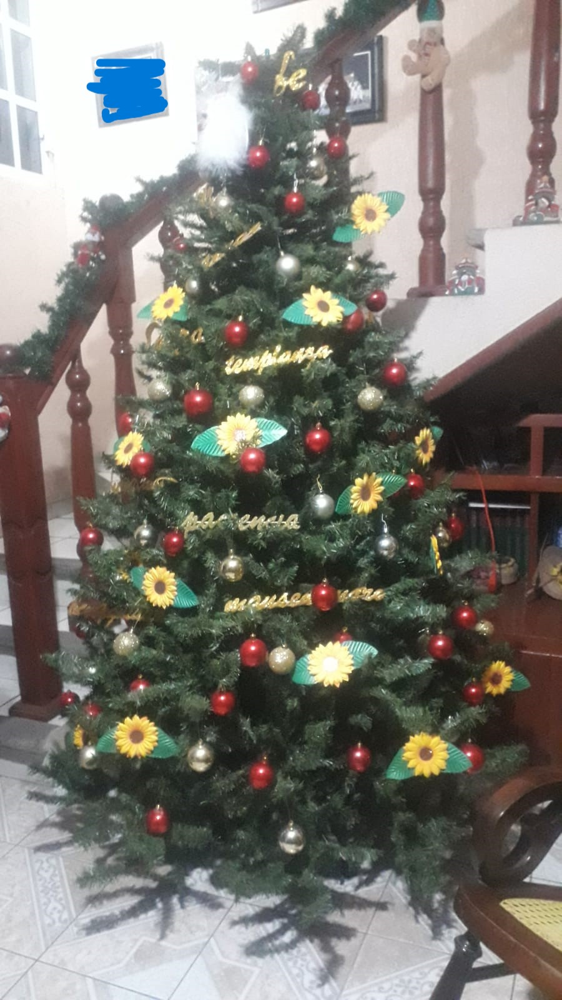
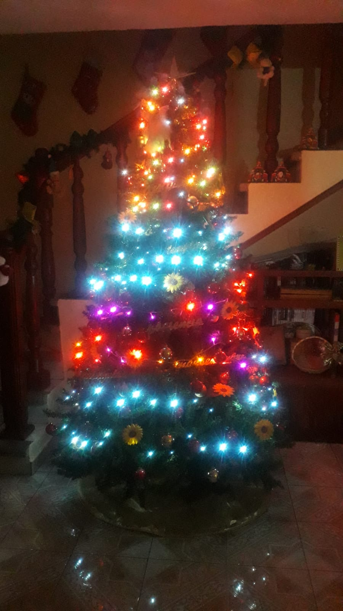

Christmas! Just a week and a half away! You haven't been naughty this year, right? I have :)

I like christmas because of the union it (usually) brings to a family, even if the true meaning has been lost somewhat and is now regalated to movies and christian sermons.

Anyway, christmas! Food! Yay :D

## My tree

Here's my christmas tree for this year:

There is something I did notice while my mom and I decorated our tree, and it's that how we've decorated it reflects (sort of) our status that year, so I'll go ahead and describe some "phases" I noticed of our tree decorations:

The earliest decorations I remember that we used where Mc Donnalds plushies; during the 2000s-2010s my family got tons of them, so it only made sense to use them for _something_. This era reflected the fact there two kids running around AND there was enough adquisitive power to go to Mc Donnalds enough times to get around 50 plushies.
