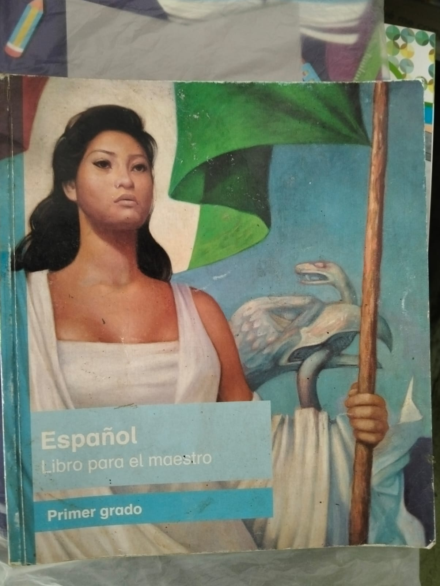

Greetings! Guess what time it is!

~~No it's not Wheather Update~~

It's normal blog post time.

## What did I do?

Today I helped my mom move her stuff from one classroom to another. That took us the whole morning. Because my mother is a elementary school teacher, she gets assigned new grades every year, and because of that she needs to move all of her stuff to the new classroom and save all of her stuff in a closet; and every year I help her out moving. Usual teacher's son stuff :)

Something that did interest me was the amount of books she held, and how many she wouldn't use ever again. {}(Even if she's retiring this year and won't be using them soon){} Same thing happens with ALL of the teachers, all of them have materials they won't be using this year.

So what did I found during my six hours of work! Many things! Including this map of Mexico with something off...

Notice something? No? Let me give you a hint: **The border between Belize and Guatemala are wrong!**

Don't even try mapping ~🥁🔔~ the date on this, because I do not think this map dates back to **_1877._**

The teacher who owned this classroom said that she uses this map because 2nd graders learn about our own state, Veracruz, and its position within the country, and I must say, other than the error previously mentioned, this is a good map :)

## Books I found

I'll be listing these along with the dates they had printed along their copyright.

### Spanish 1st Grade - 2013



{}

-   Teacher 1st Grade Spanish Book
-   Student 1st Grade Spanish Book

{}

{}

{}

{}

{}



What I find interesting is the difference is the amount of wear the student book has. The student one is _way too torn_ compared to the teacher's.

### Cartografía de México y el mundo - 2023

### Maravillas de México - 2002

I didn't check out the content inside, simply looked at the reference date and moved on. I was busy.

### Ciencias Naturales 6th Grade - 1997

### Veracruz Monograph - 1992

This is the most ancient book I found, actually! It probably describes everything in the state.

## ...And

All of these books will never see the light of day.

Unfortunately.

The subject books that are unused will stay that way because the education plan changes yearly, and the previous books are made obsolete. Meanwhile, the "resource" books (like the monograph one) become hard to find since they're with other books.

...

I just wanted to share my thoughts on this. See ya!

---

## BONUS

Can **YOU** date this map?

Share your findings either on neocities' comments or Cbox, whatever seems better for you

